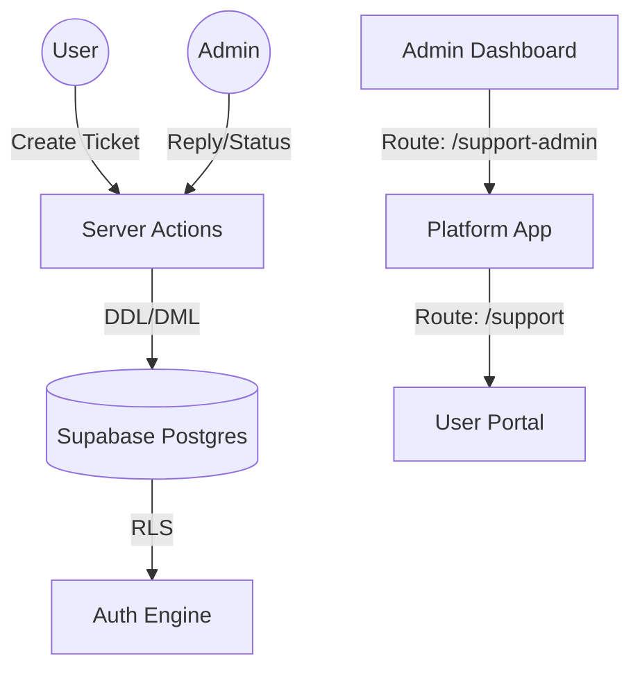

# Internal Support System (Tickets)

The Kytbox Internal Support System is a custom-built ticketing platform that allows users to submit support requests and administrators to manage them directly within the platform.

## 1. Executive Summary

- **Primary Goal:** Provide a seamless, untracked, and integrated support experience for Kytbox users while avoiding third-party costs (Zendesk/Intercom).
- **Architecture:** Built with Next.js Server Actions, Supabase (Postgres), and Tailwind CSS.
- **Key Features:** Ticket creation, urgency "bumping," real-time thread viewing, and admin management.

## 2. Architecture Overview

### 2.1 Component Logic

| Component           | Responsibility                                    | Path                             |
| :------------------ | :------------------------------------------------ | :------------------------------- | ----------------------------- |
| **Ticket Portal**   | Dashboard for users to see their ticket history.  | `(platform)/support/page.tsx`    |
| **Admin Dashboard** | High-level queue for administrators.              | `(admin)/support-admin/page.tsx` |
| **Ticket Thread**   | Individual conversation view for both User/Admin. | `[support                        | support-admin]/[id]/page.tsx` |

## 3. Data Model

The system relies on two primary tables in the `public` schema.

### 3.1 `support_tickets`

| Column           | Type          | Description                                                          |
| :--------------- | :------------ | :------------------------------------------------------------------- |
| `id`             | `uuid`        | Primary Key.                                                         |
| `user_id`        | `uuid`        | Foreign key to `profiles.id`.                                        |
| `subject`        | `text`        | Brief summary of the issue.                                          |
| `category`       | `text`        | Check: `general`, `bug`, `billing`, `feature_request`, `account`.    |
| `status`         | `text`        | Default: `open`. Check: `open`, `in_progress`, `resolved`, `closed`. |
| `urgency_score`  | `int`         | Calculated server-side based on wait time and bumps.                 |
| `last_bumped_at` | `timestamptz` | Last time the user manually requested a priority increase.           |

### 3.2 `support_messages`

| Column      | Type          | Description                                    |
| :---------- | :------------ | :--------------------------------------------- |
| `id`        | `uuid`        | Primary Key.                                   |
| `ticket_id` | `uuid`        | Foreign key to `support_tickets.id`.           |
| `sender_id` | `uuid`        | Foreign key to `profiles.id`.                  |
| `message`   | `text`        | The content of the reply.                      |
| `read_at`   | `timestamptz` | Track when the other party viewed the message. |

## 4. Security & RLS Policies

Security is enforced at the database layer using Row Level Security (RLS).

### 4.1 User Access

- **SELECT**: Users can only see tickets where `user_id = auth.uid()`.
- **INSERT**: Users can only create tickets with their own `user_id`.
- **UPDATE**: Users can update their own tickets (e.g., to bump urgency).

### 4.2 Admin Access

- **SELECT/UPDATE**: Admins can see and modify all tickets. Access is granted based on the `role = 'admin'` check in the `profiles` table.

## 5. Key Workflows

### 5.1 Urgency Bumping Logic

Users can "bump" their ticket importance once every 24 hours.

- **Action:** `bumpUrgency(ticketId)`
- **Restriction:** Enforced via `last_bumped_at` check in Server Action.
- **Impact:** Increases `urgency_score`, pushing the ticket to the top of the Admin queue.

### 5.2 Thread Communication

1.  **Submission:** `createTicket` (Server Action) creates the ticket and the initial message in a single transaction.
2.  **Reply:** `replyToTicket` adds a message. Admins replying automatically revalidates both the user and admin views.
3.  **Resolution:** Admins can mark a ticket as `resolved`, which hides it from the default active queue.

## 6. Implementation Reference

- **Server Actions:** `src/app/(platform)/support/actions.ts`
- **Migration:** `supabase/migrations/20260210190000_create_support_system.sql`
- **User Route:** `/support`
- **Admin Route:** `/support-admin`

---

_Last Updated: February 10, 2026_
