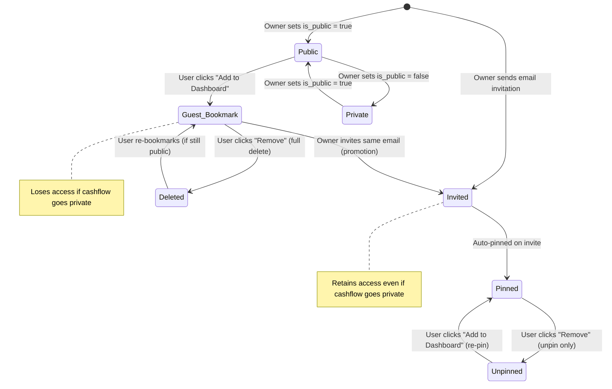

# Kytbox Cashflow Documentation

Focus: **Simple, effective personal finance tracking.**

## 1. Core Features

- **Dashboard**: High-level overview of total income, expense, and balance across owned and bookmarked books.
- **Cashflow Management**: Create, rename, delete, and duplicate cashflow "books".
- **Real-time Stats**: Instant calculation of totals with user-specific inclusion toggles.
- **Advanced Sharing**:
  - **Zero-Config Public Links**: Instantly share a read-only view of any cashflow.
  - **Secure Email Invitations**: Precise access control for external collaborators.
  - **Collaborative Editing**: Full write-access for invited editors on transaction entries.
- **Dashboard Integration**: "Add to Dashboard" workflow for persistent tracking of shared and public cashflows.

## 2. Technical Architecture

### 2.1 System Overview

The Cashflow app follows a clean separation of concerns between **Ownership**, **Permissions**, and **Persistence**.

- **Ownership**: The user who created the cashflow has absolute control.
- **Permissions**: Defined in `cashflow_shares`, determining what collaborators can do.
- **Persistence**: Preferences like "Include in Totals" are stored per-user, ensuring a customized dashboard experience that survives sessions.

### 2.2 Routing & Access Control

The application uses a hybrid routing model where `/cashflow/[id]` serves as both a private management view and a public shared surface.

- **Private Dashboard (`/cashflow`)**: Protected at the **Middleware layer** (`proxy.ts`). Redirects guests to login via an exact-match rule.
- **Detail View (`/cashflow/[id]`)**: Resolution logic determines the user's role (Owner, Editor, Viewer, or Unauthorized) based on Supabase Auth and the `cashflow_shares` registry. Middleware allows sub-paths through, letting the page-level logic decide access.
- **Error Boundaries**: A specialized `cashflow/error.tsx` provides "Smart Recovery"—offering the Support Page to logged-in users and Email Support to guests.

## 3. Database Schema (Supabase)

### 3.1 Core Tables

#### `cashflows`

The root entity for a financial book.

- `id` (uuid): Primary key.
- `user_id` (uuid): References the owner profile.
- `title` (text): User-defined name.
- `is_public` (boolean): Global visibility toggle.

#### `cashflow_entries`

Individual transaction records.

- `cashflow_id` (uuid): FK to parent book.
- `amount` (numeric): Transaction magnitude.
- `type` (text): `income` or `expense`.
- `description` (text): Context for the transaction.
- `date` (date): The logical date of the event.

### 3.2 User Settings

#### `user_settings`

Per-user application preferences.

- `user_id` (uuid): FK to `profiles.id`, Primary key.
- `currency` (text): Preferred currency code (e.g., `USD`, `IDR`). Default: `USD`.
- `created_at` (timestamptz): Record creation timestamp.
- `updated_at` (timestamptz): Last modification timestamp.

> [!NOTE]
> Currency settings are user-specific and apply globally to all cashflows. The EntryModal component receives this currency preference from user settings.

#### `cashflow_shares`

The bridge table for collaboration and bookmarking.

- `email` (text): Target user identification.
- `role` (text): `read` (viewer) or `edit` (can manage entries).
- `is_pinned` (boolean): Whether the share is visible on the user's dashboard.
- `is_included_in_totals` (boolean): Per-user dashboard calculation preference.
- `created_via_public_access` (boolean): DISTINCTION flag. Set to `true` when a user bookmarks a public link vs being explicitly invited.

### 3.2 Performance Layer: `cashflow_summaries`

A SQL View used to offload O(N) aggregation from the application server. It calculates `income`, `expense`, `balance`, and `entry_count` at the database level.

## 4. Security Model (RLS)

Permissions are enforced strictly at the database level via PostgreSQL Row Level Security (RLS).

| Action                   | Target             | Condition                                                                    |
| :----------------------- | :----------------- | :--------------------------------------------------------------------------- |
| **Manage Book**          | `cashflows`        | `auth.uid() == user_id`                                                      |
| **View Book**            | `cashflows`        | Owner OR `is_public` OR Case-insensitive Email match in `cashflow_shares`    |
| **Manage Entries**       | `cashflow_entries` | Owner OR (`cashflow_shares.role == 'edit'` AND Case-insensitive Email match) |
| **View Entries**         | `cashflow_entries` | Any user with View access to the parent Book                                 |
| **Manage Shares**        | `cashflow_shares`  | Owner of the Book only                                                       |
| **Bookmark/Unsubscribe** | `cashflow_shares`  | Authenticated users (Self-management of own records)                         |

> [!NOTE]
> All email-based security checks use `LOWER()` to ensure case-insensitive matching between auth sessions and share records.

### 4.1 Trigger-Based Column Guard

The `check_cashflow_share_update` trigger prevents privilege escalation by blocking non-owners from modifying restricted columns (`role`, `email`, `created_via_public_access`, `cashflow_id`) on `cashflow_shares`. Users can only self-manage `is_pinned` and `is_included_in_totals`.

### 4.2 Removal Behavior

- **Guest bookmarks** (`created_via_public_access = true`): Fully deleted on removal, revoking all access.
- **Explicit invites** (`created_via_public_access = false`): Only unpinned (`is_pinned = false`), preserving the permission record so the user can re-pin later.

### 4.3 Permission Matrix

| Action                     | Owner | Invited Editor | Invited Reader |  Public Guest  | Unauthenticated |
| :------------------------- | :---: | :------------: | :------------: | :------------: | :-------------: |
| View cashflow & entries    |  ✅   |       ✅       |       ✅       |       ✅       |   ✅ (public)   |
| Add/Edit/Delete entries    |  ✅   |       ✅       |       ❌       |       ❌       |       ❌        |
| Rename/Delete cashflow     |  ✅   |       ❌       |       ❌       |       ❌       |       ❌        |
| Toggle `is_public`         |  ✅   |       ❌       |       ❌       |       ❌       |       ❌        |
| Invite/Remove users        |  ✅   |       ❌       |       ❌       |       ❌       |       ❌        |
| Change user roles          |  ✅   |       ❌       |       ❌       |       ❌       |       ❌        |
| Pin to own dashboard       |  N/A  |       ✅       |       ✅       |       ✅       |       ❌        |
| Unpin from own dashboard   |  N/A  |   ✅ (unpin)   |   ✅ (unpin)   |  ✅ (delete)   |       ❌        |
| Re-pin after unpin         |  N/A  |       ✅       |       ✅       | ✅ (if public) |       ❌        |
| Toggle "Include in Totals" |  N/A  |       ✅       |       ✅       |       ✅       |       ❌        |
| Modify own `role`          |  N/A  |  ❌ (trigger)  |  ❌ (trigger)  |  ❌ (trigger)  |       ❌        |

> [!IMPORTANT]
> "Public Guest" refers to an authenticated user who bookmarked a public cashflow. "Unauthenticated" users can only view public cashflows without any interactive features.

### 4.4 Access Lifecycle

**Key transitions:**

- **Promotion**: When an owner invites a user who already has a guest bookmark, the record is promoted to an explicit invite (`created_via_public_access = false`). The user retains access even if the cashflow later becomes private.
- **Demotion (Private)**: When a cashflow is set to private, public guests with stale bookmarks cannot re-pin or re-subscribe. Their existing bookmark becomes inaccessible.
- **Re-pinning (Invited)**: An invited user who unpinned a cashflow can always re-pin it, regardless of `is_public` status, because their permission record is preserved.
- **Re-pinning (Guest)**: A public guest who deleted their bookmark can only re-subscribe if the cashflow is still public.

## 5. Design Decisions & Rationale

### 5.1 Explicit Bookmarking vs Auto-Include

**Rationale**: Users often visit public cashflows out of curiosity. Auto-adding every visited link to the dashboard causes clutter.
**Decision**: We implemented an explicit "Add to Dashboard" flow. This creates a `cashflow_shares` record with the `created_via_public_access` flag, signaling intent to track.

### 5.2 Server-Side Filtering in `page.tsx`

**Rationale**: RLS allows users to _read_ any public cashflow, which means a simple `select *` would leak every public book on the platform into every user's personal dashboard.
**Decision**: The dashboard query explicitly filters for `user_id == CURRENT_USER` OR `id IN (USER_SHARES)`. This keeps individual dashboards private and relevant.

### 5.3 Promotion & Proactive Access

**Rationale**: Users who previously bookmarked a public link ("Guest") may later be invited as collaborators.
**Decision**:

- **Promotion**: When an owner invites a user by email, any existing guest bookmark is "promoted" to an invited record (`created_via_public_access = false`).
- **Auto-Pin**: Invitations automatically set `is_pinned = true` and `is_included_in_totals = true`, making the cashflow immediately visible on the recipient's dashboard.
- **Smart Filtering**: The "People with access" list hides guest bookmarkers who are only "Viewers" to prevent clutter, but **always** shows invited users and anyone with "Editor" access.

### 5.4 Security Invoker Views

**Rationale**: The `cashflow_summaries` view must respect the visitor's permissions.
**Decision**: The view is defined with `security_invoker = true`, ensuring that calculations ONLY include data the current user is authorized to see.

## 6. API Surface (Server Actions)

### Share Management (`share-actions.ts`)

- `togglePublic(id, status)`: Updates global visibility.
- `inviteUser(id, email, role)`: Formal collaboration invitation.
- `subscribeToPublicCashflow(id)`: Implementation of the "Add to Dashboard" logic.
- `toggleCashflowInclusion(id, toggle)`: Saves user preference for dashboard stats.

## 7. Recurring Transactions & Projections [✅ Implemented]

- **Smart Recurrence**: Support for Monthly and Yearly transactions.
- **Granular Calculation Logic (Per-Item)**:
  - **Prorated**: Automatically sets aside `1/12th` per month to smooth out large annual fees.
  - **Exact**: Only impacts the projection if the specific anniversary date falls within the window.
- **Dynamic Future Projections**: Calculates a "Real Available Balance" through the **end of the next month** (~2-month window).
  - **Baseline (Settled Cash)**: Ground-truth cash based strictly on transactions dated _today or earlier_.
  - **Projection Flow**: `Settled Cash + Upcoming Inflows - Upcoming Outflows = Estimated Result`. Visual operator badges (`-`, `+`, `=`) make the math manually verifiable.
  - **Standardized Time-Cutoff**: All dates are parsed as **Local Midnight** (ignoring UTC offsets) to prevent "vanishing transactions" on the current date. An entry dated "Today" is treated as Settled and excluded from Upcoming to prevent double-counting.
  - 🔴 **Deficit Risk** indicator triggered if the result drops below zero.

---

## 8. Date Filtering [✅ Implemented]

- **Preset Pills**: "All Time", "This Month", "Last Month", "Last 3 Months", "Custom".
- **Custom Range**: Native `<input type="date">` — no extra dependency.
- **Client-Side Filtering**: `useMemo` against ISO `YYYY-MM-DD` strings — zero timezone drift.
- **Scope**: Summary stats (Income / Expense / Balance) and the entries table + charts all react to the filter.
- **Intentionally Unfiltered**: Projections and BudgetManager stay on unfiltered entries — their logic is time-aware by design.
- **Validation**: `dateFilterPresetSchema` in `validation.schemas.client.ts` (Zod/mini).
- **A11y**: `role="radiogroup"` / `aria-checked` on preset pills; labelled date inputs. WCAG 2.2 compliant.

---

## 9. Hard Budgets & Alerts [✅ Implemented]

- **Per-Category Monthly Limits**: Set a spending cap on any expense category (Food, Transport, Utilities, Entertainment, Shopping, Health, Other).
- **Real-Time Progress Tracking**: Progress bars calculate current-month spend vs. the budget limit on the client — no extra server round-trips.
- **Color-Coded Status System**:
  - 🟢 **Green** (`< 80%`): On track.
  - 🟡 **Amber** (`80–99%`): Warning — approaching limit.
  - 🔴 **Maxed Out** (`= limit`): Budget exhausted — red bar, amber badge.
  - 🔴🔴 **Over Budget** (`> limit`): Limit exceeded — dark red bar and badge.
  - Comparisons use raw amounts (`spent > budget.amount`) to avoid floating-point imprecision from percentage math.
- **Risk-Sorted Display**: Budget cards sorted by spend percentage descending — highest risk surfaces first.
- **Owner-Only Management**: Create, edit, and delete budgets. Editors can read; public viewers cannot see any budget data.
- **Unique Category Enforcement**: One budget per category per cashflow — enforced at DB level via `UNIQUE(cashflow_id, category)` constraint and `UPSERT` logic.
- **Security**: Dedicated `cashflow_budgets` table with RLS. Owner policy covers all operations; editor policy uses `auth.jwt() ->> 'email'` for safe email comparison without touching `auth.users`.

---

## 10. Current Implementation Status

✅ Dashboard, CRUD, Sharing, Bookmarking, Persistence  
✅ Visual Charts (Bar, Area, Category Donut)  
✅ Entry Categories  
✅ Recurring Transactions & Smart Projections  
✅ Date Filtering (Presets + Custom Range)  
✅ Hard Budgets & Alerts  
✅ DTO Safety Layer — zero raw DB rows leaked to client  
✅ SQL View aggregation (`cashflow_summaries`) — O(N) offloaded to DB  
✅ Scalable sharing model with full RLS audit  
🔲 CSV Export (respects date filter, next up)

---

_For loading state details, see [LOADING_STATES.md](./LOADING_STATES.md)_

_Last Updated: March 11, 2026_
