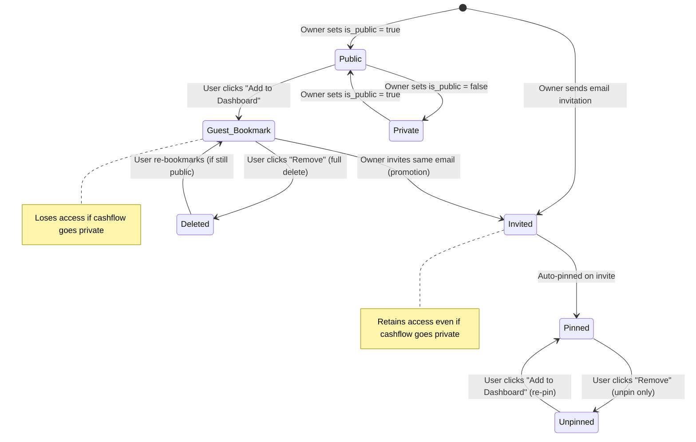

# Kytbox Cashflow Documentation

Focus: **Simple, effective personal finance tracking.**

## 1. Core Features

- **Dashboard**: High-level overview of total income, expense, and balance across owned and bookmarked books.
- **Cashflow Management**: Create, rename, delete, and duplicate cashflow "books".
- **Real-time Stats**: Instant calculation of totals with user-specific inclusion toggles.
- **Advanced Sharing**:
  - **Zero-Config Public Links**: Instantly share a read-only view of any cashflow.
  - **Secure Email Invitations**: Precise access control for external collaborators.
  - **Collaborative Editing**: Full write-access for invited editors on transaction entries.
- **Dashboard Integration**: "Add to Dashboard" workflow for persistent tracking of shared and public cashflows.
- **Savings Goals**: Create goals from each cashflow detail page (/cashflow/[id]) and track matching contributions across owned and accessible shared cashflow books.

## 2. Technical Architecture

### 2.1 System Overview

The Cashflow app follows a clean separation of concerns between **Ownership**, **Permissions**, and **Persistence**.

- **Ownership**: The user who created the cashflow has absolute control.
- **Permissions**: Defined in `cashflow_shares`, determining what collaborators can do.
- **Persistence**: Preferences like "Include in Totals" are stored per-user, ensuring a customized dashboard experience that survives sessions.

### 2.2 Routing & Access Control

The application uses a hybrid routing model where `/cashflow/[id]` serves as both a private management view and a public shared surface.

- **Private Dashboard (`/cashflow`)**: Protected at the **Proxy layer** (`src/proxy.ts`). Redirects guests to login via an exact-match rule.
- **Detail View (`/cashflow/[id]`)**: Resolution logic determines the user's role (Owner, Editor, Viewer, or Unauthorized) based on Supabase Auth and the `cashflow_shares` registry. The Proxy allows this mixed-access sub-path through, letting the page-level logic decide access.
- **Error Boundaries**: A specialized `cashflow/error.tsx` provides "Smart Recovery"—offering the Support Page to logged-in users and Email Support to guests.

## 3. Database Schema (Supabase)

### 3.1 Core Tables

#### `cashflows`

The root entity for a financial book.

- `id` (uuid): Primary key.
- `user_id` (uuid): References the owner profile.
- `title` (text): User-defined name.
- `is_public` (boolean): Global visibility toggle.

#### `cashflow_entries`

Individual transaction records.

- `cashflow_id` (uuid): FK to parent book.
- `amount` (numeric): Transaction magnitude.
- `type` (text): `income` or `expense`.
- `description` (text): Context for the transaction.
- `date` (date): The logical date of the event.

#### cashflow_goals

Savings targets owned by the cashflow owner.

- **cashflow_id** (uuid): The owning cashflow book.
- **title** (text): The goal name.
- **target_amount** (numeric): Positive target amount.
- **deadline** (date, nullable): Optional target date.
- **is_deleted** (boolean): Soft-archive flag; archived goals are hidden while their contributions remain.
- **Contributions**: An expense entry in any accessible book the user can edit contributes only when its internal `goal_id` points to the selected goal. The human-readable category remains `Goal: {goal name}` and the source cashflow name is shown in goal cards, detail pages, and the category picker.
- **Goal ownership**: Each goal belongs to the cashflow where it was created, even when contributions come from another accessible cashflow book.

### 3.2 User Settings

#### `user_settings`

Per-user application preferences.

- `user_id` (uuid): FK to `profiles.id`, Primary key.
- `currency` (text): Preferred currency code (e.g., `USD`, `IDR`). Default: `USD`.
- `created_at` (timestamptz): Record creation timestamp.
- `updated_at` (timestamptz): Last modification timestamp.

> [!NOTE]
> Currency settings are user-specific and apply globally to all cashflows. The EntryModal component receives this currency preference from user settings.

#### `cashflow_shares`

The bridge table for collaboration and bookmarking.

- `email` (text): Target user identification.
- `role` (text): `read` (viewer) or `edit` (can manage entries).
- `is_pinned` (boolean): Whether the share is visible on the user's dashboard.
- `is_included_in_totals` (boolean): Per-user dashboard calculation preference.
- `created_via_public_access` (boolean): DISTINCTION flag. Set to `true` when a user bookmarks a public link vs being explicitly invited.

### 3.2 Performance Layer: `cashflow_summaries`

A SQL View used to offload O(N) aggregation from the application server. It calculates `income`, `expense`, `balance`, and `entry_count` at the database level.

## 4. Security Model (RLS)

Permissions are enforced strictly at the database level via PostgreSQL Row Level Security (RLS).

| Action                   | Target             | Condition                                                                    |
| :----------------------- | :----------------- | :--------------------------------------------------------------------------- |
| **Manage Book**          | `cashflows`        | `auth.uid() == user_id`                                                      |
| **View Book**            | `cashflows`        | Owner OR `is_public` OR Case-insensitive Email match in `cashflow_shares`    |
| **Manage Entries**       | `cashflow_entries` | Owner OR (`cashflow_shares.role == 'edit'` AND Case-insensitive Email match) |
| **View Entries**         | `cashflow_entries` | Any user with View access to the parent Book                                 |
| **Manage Shares**        | `cashflow_shares`  | Owner of the Book only                                                       |
| **Bookmark/Unsubscribe** | `cashflow_shares`  | Authenticated users (Self-management of own records)                         |
| **View savings goals**    | `cashflow_goals`         | Owner or authenticated user with an explicit `read`/`edit` share; archived goals are owner-only |
| **Manage savings goals**  | `cashflow_goals`         | Owner of the goal's cashflow only; archive is a soft delete                  |

> [!NOTE]
> All email-based security checks use `LOWER()` to ensure case-insensitive matching between auth sessions and share records.

### 4.1 Trigger-Based Column Guard

The `check_cashflow_share_update` trigger prevents privilege escalation by blocking non-owners from modifying restricted columns (`role`, `email`, `created_via_public_access`, `cashflow_id`) on `cashflow_shares`. Users can only self-manage `is_pinned` and `is_included_in_totals`.

Savings goal RLS uses the hardened `is_cashflow_owner(cashflow_id)` helper for owner mutations. Active goals are visible to the owner and authenticated users with an explicit share. Archived goals remain readable only by their owner so PostgreSQL can complete the soft-archive update; application queries exclude archived rows, and public or anonymous viewers receive no goal rows.

### 4.2 Removal Behavior

- **Guest bookmarks** (`created_via_public_access = true`): Fully deleted on removal, revoking all access.
- **Explicit invites** (`created_via_public_access = false`): Only unpinned (`is_pinned = false`), preserving the permission record so the user can re-pin later.

### 4.3 Permission Matrix

| Action                     | Owner | Invited Editor | Invited Reader |  Public Guest  | Unauthenticated |
| :------------------------- | :---: | :------------: | :------------: | :------------: | :-------------: |
| View cashflow & entries    |  ✅   |       ✅       |       ✅       |       ✅       |   ✅ (public)   |
| Add/Edit/Delete entries    |  ✅   |       ✅       |       ❌       |       ❌       |       ❌        |
| Rename/Delete cashflow     |  ✅   |       ❌       |       ❌       |       ❌       |       ❌        |
| Toggle `is_public`         |  ✅   |       ❌       |       ❌       |       ❌       |       ❌        |
| Invite/Remove users        |  ✅   |       ❌       |       ❌       |       ❌       |       ❌        |
| Change user roles          |  ✅   |       ❌       |       ❌       |       ❌       |       ❌        |
| Pin to own dashboard       |  N/A  |       ✅       |       ✅       |       ✅       |       ❌        |
| Unpin from own dashboard   |  N/A  |   ✅ (unpin)   |   ✅ (unpin)   |  ✅ (delete)   |       ❌        |
| Re-pin after unpin         |  N/A  |       ✅       |       ✅       | ✅ (if public) |       ❌        |
| Toggle "Include in Totals" |  N/A  |       ✅       |       ✅       |       ✅       |       ❌        |
| View savings goals         |   ✅   |       ✅       |       ✅       |       ❌       |       ❌        |
| Create/edit/archive goals  |   ✅   |       ❌       |       ❌       |       ❌       |       ❌        |
| Add goal contributions     |   ✅   |       ✅       |       ❌       |       ❌       |       ❌        |
| Modify own `role`          |  N/A  |  ❌ (trigger)  |  ❌ (trigger)  |  ❌ (trigger)  |       ❌        |

> [!NOTE]
> Savings goals are intentionally private to the goal owner and authenticated users with an explicit share. Public cashflow viewers do not receive goal rows.

> [!IMPORTANT]
> "Public Guest" refers to an authenticated user who bookmarked a public cashflow. "Unauthenticated" users can only view public cashflows without any interactive features.

### 4.4 Access Lifecycle

**Key transitions:**

- **Promotion**: When an owner invites a user who already has a guest bookmark, the record is promoted to an explicit invite (`created_via_public_access = false`). The user retains access even if the cashflow later becomes private.
- **Demotion (Private)**: When a cashflow is set to private, public guests with stale bookmarks cannot re-pin or re-subscribe. Their existing bookmark becomes inaccessible.
- **Re-pinning (Invited)**: An invited user who unpinned a cashflow can always re-pin it, regardless of `is_public` status, because their permission record is preserved.
- **Re-pinning (Guest)**: A public guest who deleted their bookmark can only re-subscribe if the cashflow is still public.

## 5. Design Decisions & Rationale

### 5.1 Explicit Bookmarking vs Auto-Include

**Rationale**: Users often visit public cashflows out of curiosity. Auto-adding every visited link to the dashboard causes clutter.
**Decision**: We implemented an explicit "Add to Dashboard" flow. This creates a `cashflow_shares` record with the `created_via_public_access` flag, signaling intent to track.

### 5.2 Server-Side Filtering in `page.tsx`

**Rationale**: RLS allows users to _read_ any public cashflow, which means a simple `select *` would leak every public book on the platform into every user's personal dashboard.
**Decision**: The dashboard query explicitly filters for `user_id == CURRENT_USER` OR `id IN (USER_SHARES)`. This keeps individual dashboards private and relevant.

### 5.3 Promotion & Proactive Access

**Rationale**: Users who previously bookmarked a public link ("Guest") may later be invited as collaborators.
**Decision**:

- **Promotion**: When an owner invites a user by email, any existing guest bookmark is "promoted" to an invited record (`created_via_public_access = false`).
- **Auto-Pin**: Invitations automatically set `is_pinned = true` and `is_included_in_totals = true`, making the cashflow immediately visible on the recipient's dashboard.
- **Smart Filtering**: The "People with access" list hides guest bookmarkers who are only "Viewers" to prevent clutter, but **always** shows invited users and anyone with "Editor" access.

### 5.4 Security Invoker Views

**Rationale**: The `cashflow_summaries` view must respect the visitor's permissions.
**Decision**: The view is defined with `security_invoker = true`, ensuring that calculations ONLY include data the current user is authorized to see.

## 6. API Surface (Server Actions)

### Share Management (`share-actions.ts`)

- `togglePublic(id, status)`: Updates global visibility.
- `inviteUser(id, email, role)`: Formal collaboration invitation.
- `subscribeToPublicCashflow(id)`: Implementation of the "Add to Dashboard" logic.
- `toggleCashflowInclusion(id, toggle)`: Saves user preference for dashboard stats.
- **Goal lifecycle**: Goal deletion is a soft archive; it sets `is_deleted` to true and preserves all related cashflow entries.
- `addGoal(formData)`: Creates an owner-managed savings goal.
- `updateGoal(formData)`: Updates an owner-managed savings goal.
- `deleteGoal(goalId, cashflowId)`: Archives an owner-managed savings goal without deleting its entries.

## 7. Recurring Transactions & Projections [✅ Implemented]

- **Smart Recurrence**: Support for Monthly and Yearly transactions.
- **Granular Calculation Logic (Per-Item)**:
  - **Prorated**: Automatically sets aside `1/12th` per month to smooth out large annual fees.
  - **Exact**: Only impacts the projection if the specific anniversary date falls within the window.
- **Dynamic Future Projections**: Calculates a "Real Available Balance" through the **end of the next month** (~2-month window).
  - **Baseline (Settled Cash)**: Ground-truth cash based strictly on transactions dated _today or earlier_.
  - **Projection Flow**: `Settled Cash + Upcoming Inflows - Upcoming Outflows = Estimated Result`. Visual operator badges (`-`, `+`, `=`) make the math manually verifiable.
  - **Standardized Time-Cutoff**: All dates are parsed as **Local Midnight** (ignoring UTC offsets) to prevent "vanishing transactions" on the current date. An entry dated "Today" is treated as Settled and excluded from Upcoming to prevent double-counting.
  - 🔴 **Deficit Risk** indicator triggered if the result drops below zero.

---

## 8. Date Filtering [✅ Implemented]

- **Preset Pills**: "All Time", "This Month", "Last Month", "Last 3 Months", "Custom".
- **Custom Range**: Native `<input type="date">` — no extra dependency.
- **Client-Side Filtering**: `useMemo` against ISO `YYYY-MM-DD` strings — zero timezone drift.
- **Scope**: Summary stats (Income / Expense / Balance) and the entries table + charts all react to the filter.
- **Intentionally Unfiltered**: Projections and BudgetManager stay on unfiltered entries — their logic is time-aware by design.
- **Validation**: `dateFilterPresetSchema` in `validation.schemas.client.ts` (Zod/mini).
- **A11y**: `role="radiogroup"` / `aria-checked` on preset pills; labelled date inputs. WCAG 2.2 compliant.

---

## 9. Hard Budgets & Alerts [✅ Implemented]

- **Per-Category Monthly Limits**: Set a spending cap on any expense category (Food, Transport, Utilities, Entertainment, Shopping, Health, Other).
- **Real-Time Progress Tracking**: Progress bars calculate current-month spend vs. the budget limit on the client — no extra server round-trips.
- **Color-Coded Status System**:
  - 🟢 **Green** (`< 80%`): On track.
  - 🟡 **Amber** (`80–99%`): Warning — approaching limit.
  - 🔴 **Maxed Out** (`= limit`): Budget exhausted — red bar, amber badge.
  - 🔴🔴 **Over Budget** (`> limit`): Limit exceeded — dark red bar and badge.
  - Comparisons use raw amounts (`spent > budget.amount`) to avoid floating-point imprecision from percentage math.
- **Risk-Sorted Display**: Budget cards sorted by spend percentage descending — highest risk surfaces first.
- **Owner-Only Management**: Create, edit, and delete budgets. Editors can read; public viewers cannot see any budget data.
- **Unique Category Enforcement**: One budget per category per cashflow — enforced at DB level via `UNIQUE(cashflow_id, category)` constraint and `UPSERT` logic.
- **Security**: Dedicated `cashflow_budgets` table with RLS. Owner policy covers all operations; editor policy uses `auth.jwt() ->> 'email'` for safe email comparison without touching `auth.users`.

---

## 10. Savings Goals [✅ Implemented]

- **Cashflow detail location**: Goals are visible and manageable on `/cashflow/[id]`, where they stay scoped to the selected cashflow book.
- **Archive RLS**: Only the goal's cashflow owner can archive, edit, or restore goal rows. The owner-only archived-row policy exists to support the soft-archive update without exposing archived goals to shared users.
- **Cross-book contributions**: When adding an entry to an editable cashflow, the Category menu includes available goals and identifies each goal's source cashflow. Selecting one stores the exact category `Goal: {goal name}` and an internal `goal_id` relation, initially setting the entry type to `expense`. Changing the type clears the goal category and relation. The ID is not displayed in the UI.
- **Progress**: Goal cards and the goal detail route aggregate only the internal goal relation, so renaming, archiving, and recreating similarly named goals cannot reassign historical contributions. Progress totals are computed in the database under RLS.
- **Archive behavior**: The archive action sets `is_deleted = true`; it never deletes the goal or its related cashflow entries. Archived goals are hidden from active goal views and cannot receive new contributions.
- **Archive confirmation**: The GoalCard archive action opens the shared accessible confirmation dialog. Cancel is the safe default, and the dialog remains open while the archive request is pending so failures can be retried.
- **Archived contributions**: Existing entries linked to an archived goal remain editable as transactions. Saving their details preserves the relation; changing their category or type explicitly detaches them.
- **Permissions**: Users with read or edit access can view goals on a shared cashflow. Only the owner of the goal's cashflow can create, edit, or delete it. Invited editors can add contributions where they can edit entries.
- **Detail route**: `/cashflow/goal/[goalId]` lists matching contributions with search and month filtering.

---

## 11. Audit Hardening [Implemented]

- **Optional budgets**: Budget threshold checks use `maybeSingle()` because a missing category budget is normal. This prevents expected no-budget lookups from surfacing as PostgREST 406 errors.
- **CSV export**: Every exported field is quoted and escaped, including commas, quotes, and newlines. User-provided text beginning with spreadsheet formula prefixes is neutralized before download.
- **Goal route protection**: `/cashflow/goal/[goalId]` is protected at the proxy boundary and covered by the unauthenticated route-protection test.
- **Notification writes**: Notifications are created by the server-side service-role client only. Public `anon` and `authenticated` INSERT privileges and the broad INSERT policy are revoked by `20260728130000_harden_notification_insert_policy.sql`.
- **Verification**: The audit fix set passes the unit suite, lint, TypeScript typecheck, production build, and whitespace checks.

---

## 12. Current Implementation Status

✅ Dashboard, CRUD, Sharing, Bookmarking, Persistence  
✅ Visual Charts (Bar, Area, Category Donut)  
✅ Entry Categories  
✅ Recurring Transactions & Smart Projections  
✅ Date Filtering (Presets + Custom Range)  
✅ Hard Budgets & Alerts  
✅ DTO Safety Layer — zero raw DB rows leaked to client  
✅ SQL View aggregation (`cashflow_summaries`) — O(N) offloaded to DB  
✅ Scalable sharing model with full RLS audit  
✅ CSV Export (respects date filter)  
✅ Savings Goals on `/cashflow/[id]` with cross-book goal contributions  
✅ Recurring Entry Auto-Generation (`generateRecurringEntries` server action & auto-gen banner)  
✅ Duplicate Cashflow Book (`duplicateCashflow` action)  

---

_For loading state details, see [LOADING_STATES.md](./LOADING_STATES.md)_

_Last Updated: August 8, 2026_
